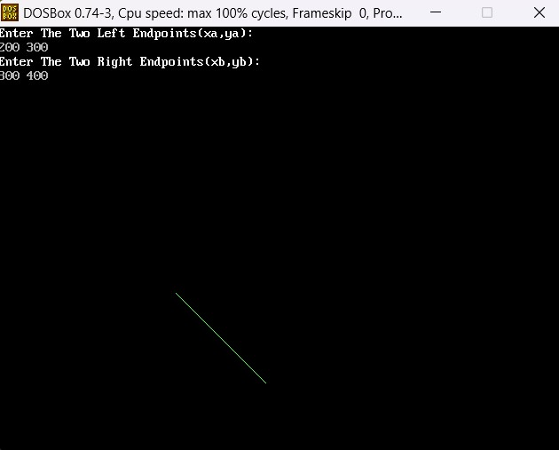

## EX 1: DDA ALGORITHM 

**Aim :**

To  implement the DDA algorithm to draw a line using a c coding

**Algorithms :**

Step 1 − Get the input of two end points (X0,Y0) and (X1,Y1)

Step 2 − Calculate the difference between two end points dx and  dy 

Step 3 − If dx > dy, then you need more steps in x coordinate; otherwise in y coordinate.

Step 4 − Calculate the increment in x coordinate and y coordinate

Step 5 − Plot the pixel by successfully incrementing x and y coordinates accordingly and complete the drawing of the line

**Program :**

```
#include<stdio.h>
#include<conio.h>
#include<math.h>
#include<graphics.h>
main()
{
int gd=DETECT,gm;
int xa,xb,ya,yb;
float step,dx,dy;
float x,y,xinc,yinc;
initgraph(&gd,&gm,"C://TURBOC3//BGI");
printf("Enter The Two Left Endpoints(xa,ya):\n");
scanf("%d%d",&xa,&ya);
printf("Enter The Two Right Endpoints(xb,yb):\n");
scanf("%d%d",&xb,&yb);
dx=abs(xa-xb);
dy=abs(ya-yb);
if(dx >= dy)
step=dx;
else
step =dy;
x=xa; y=ya;
putpixel(x, y, 10);
xinc=dx/step;
yinc=dy/step;
while(x <= xb)
{
 x = x + xinc;
 y = y + yinc;
 putpixel(x, y, 10);
}
 getch();
 return(0);
}
```

**Output :**





**Result :**

Thus the Bresenham’s algorithm for line using a c coding is implemented successfully.
